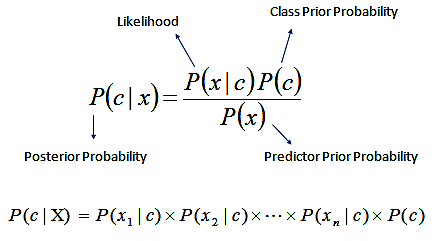

# ML-Navie-Bayes-Model
A Naive Bayes model for predicting the class of IMDB's users' comments. 

For running this program, these libraries are required:

- from __future__ import division

- import tokenizer

- import math

- import numpy as np

- import os

- import scipy.interpolate

This model tells us if a given comment is a positive one or a negative comment. For the learning process, I gave this model 25000 comments (each class has 12500 instances). By processing all labeled training data and using naive Bayes, the model computes and stores the information (probabilities) about input vectors X (comments), their features (words), and the classes Y (positive or negative) they belong to. 

You can see the Naive Bayes Classifier here: [1]

For a new data, based on the feature vector of the new data and their precomputed probabilities of features observation in each class, it calculates two probabilities. One is the comment that belongs to the negative class, and the other one is the comment that belongs to the positive class. The higher probability is the predicted class.

Large_movie_review_dataset has train and test folders. Each folder contains the pos and neg comments. First, we train the model with data in the train set. Then we can see how it performs on the test set.

The comments in the .py file will help you to have a better intuition of how it works.

Thank you for your attention!

[1]: https://uc-r.github.io/naive_bayes
